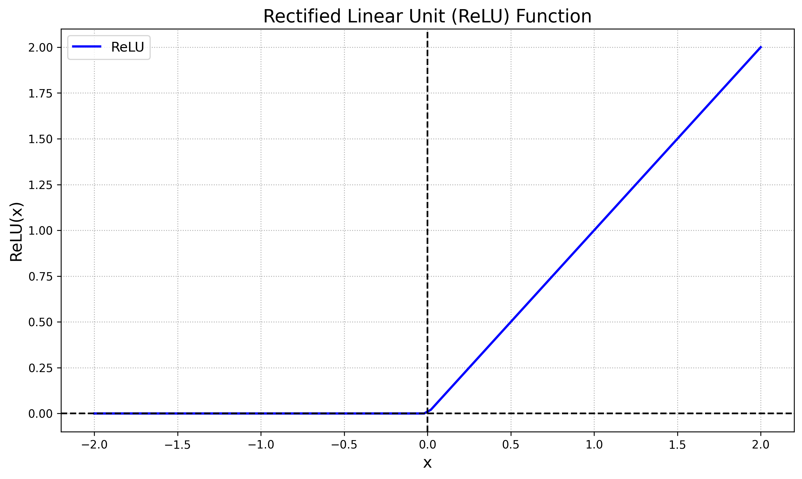

2024/07/31, #ML #wiki #umarik

Rectifier Linear Unit, aka ReLU is a type of [[activation function]], which returns positive part of the argument given. It denotes with an equation:
$$f(x)=x^+=\max(0,x)=\frac{x+|x|}{2}=\begin{cases} x & \text{if } x>0, \\ 0 & \text{otherwise},\end{cases}$$
where $x$ is the input to a neuron.

